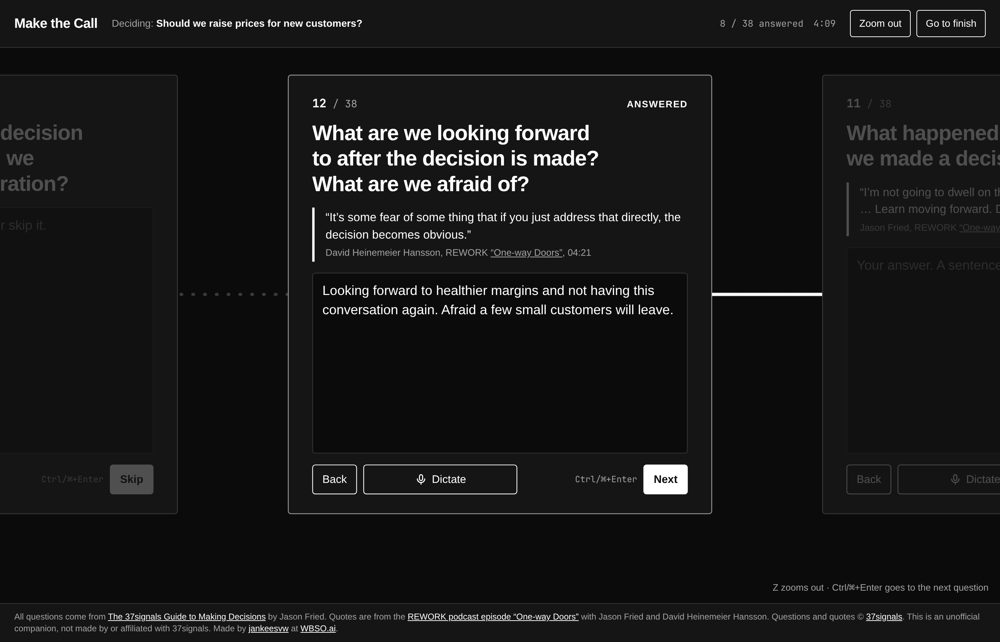
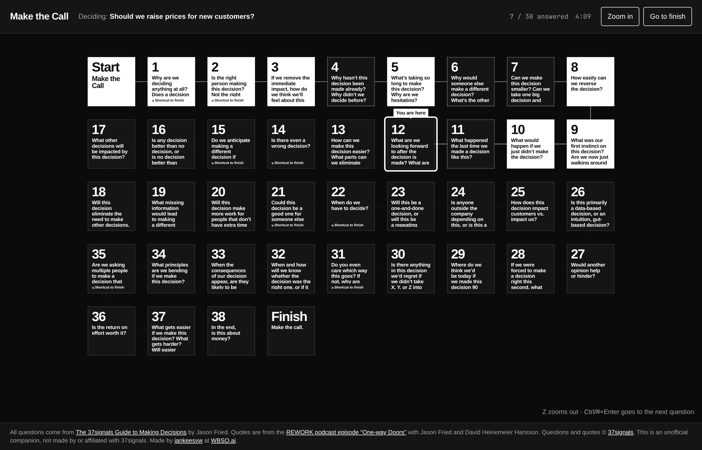
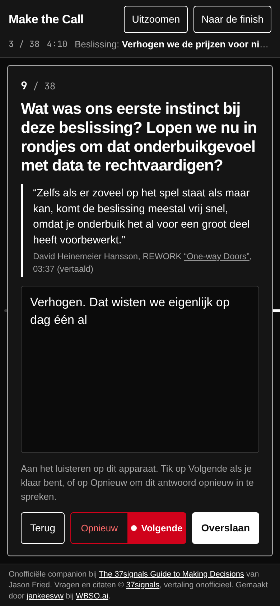

# Make the Call

A walk through [The 37signals Guide to Making Decisions](https://37signals.com/how-we-make-decisions). Stuck on a decision? Answer its 38 questions one card at a time, and make the call.

**Try it: https://jankeesvw.github.io/decisions/**

I've always found the guide an interesting way to look at decisions, so I made something that lets you walk through it when you're actually stuck on one.

## How it works

Type what you're deciding and whether it's a one-way or a two-way door. Then answer the questions in the order they appear in the guide. A sentence is plenty, and you can skip anything that doesn't apply. The guide says it best: these aren't a checklist.

Sixteen of the questions come with a quote from Jason Fried or David Heinemeier Hansson, taken from the REWORK episode [One-way Doors](https://37signals.com/podcast/one-way-doors/), with the timestamp so you can listen for yourself.

Some questions settle it on their own. Answer "no" to "Does a decision actually need to be made here?" and there's nothing left to do. Eight questions like that have a shortcut straight to the finish, which notes why you ended up there and fills in the call where the answer makes it obvious.

At the finish you pick where you landed (do it, don't, no decision needed, hand it to someone else, decide later), write the call in one sentence and copy everything as Markdown. Or copy a share link: all your answers are packed into the URL itself, so whoever opens it sees your decision read-only, without anything being stored on a server.

A timer runs in the corner. Jason and David say most of their calls take about five minutes, so it underlines itself when you pass that.

## Zoom out to see where you are

Press `Z` or tap Zoom out to see the whole trail. Answered questions light up white, skipped ones get a dashed border, and if you took a shortcut the questions after it fade out. Click any card to jump there.

## Dictate instead of typing

Every question has a Dictate button. While it listens it splits into Reset (start this answer over) and Next (stop and move on), so you can talk your way through the whole guide on your phone. It uses the browser's built-in speech recognition, on the device when the browser supports that. Your keyboard's microphone key works too.

The whole thing is also available in Dutch, including the questions and quotes. Switch languages at the top of the first card.

## Running it yourself

It's a single `index.html` with plain JavaScript. No build step, no dependencies, no server. Open it in a browser or put it on any static host.

Your answers stay in your own browser (localStorage). Nothing is sent anywhere, except your voice when the browser's speech recognition doesn't run on the device. Dictation needs HTTPS.

## Credits

All 38 questions come from [The 37signals Guide to Making Decisions](https://37signals.com/how-we-make-decisions) by Jason Fried. The quotes are from the REWORK podcast episode [One-way Doors](https://37signals.com/podcast/one-way-doors/) with Jason Fried and David Heinemeier Hansson. Questions and quotes © [37signals](https://37signals.com).

This is an unofficial companion, not made by or affiliated with 37signals. The Dutch translation is unofficial too.

Made by [jankeesvw](https://jankeesvw.com) at [WBSO.ai](https://wbso.ai).
